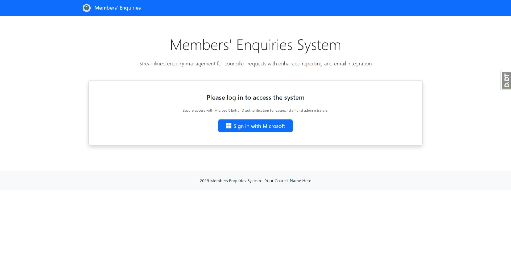
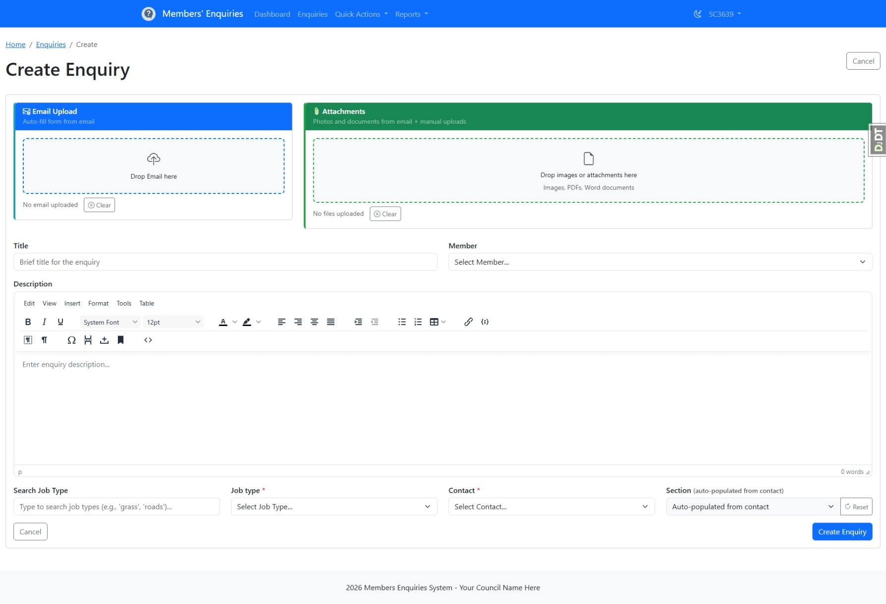
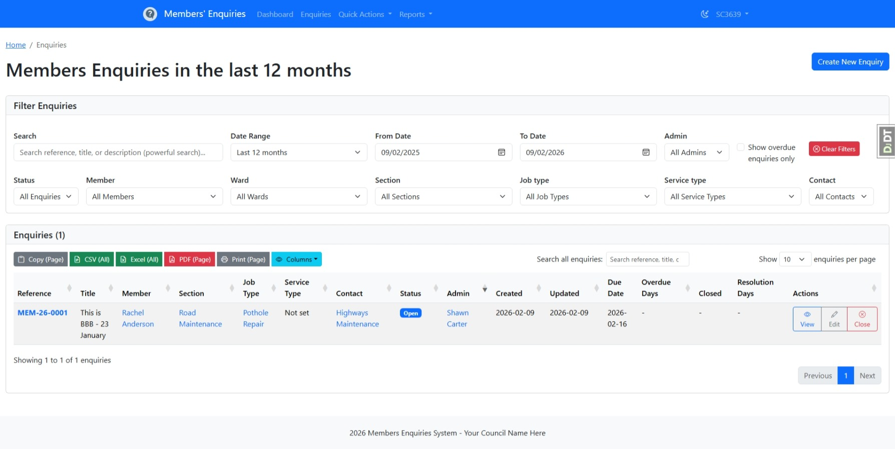
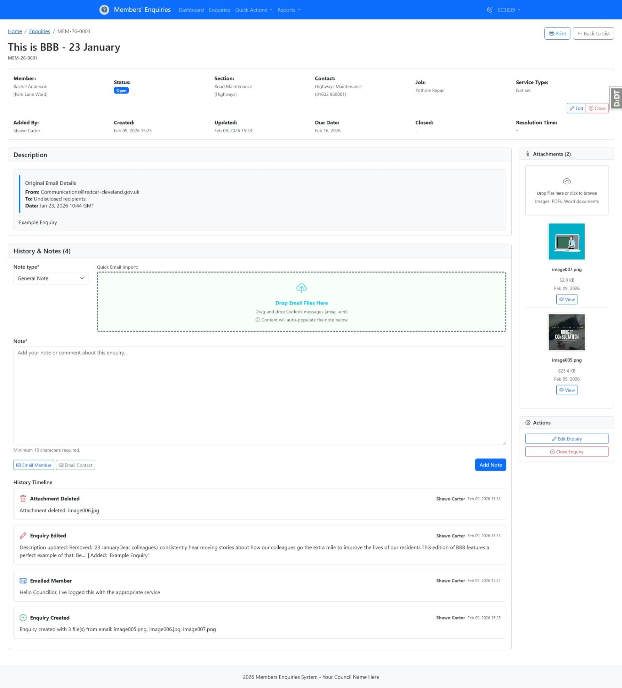
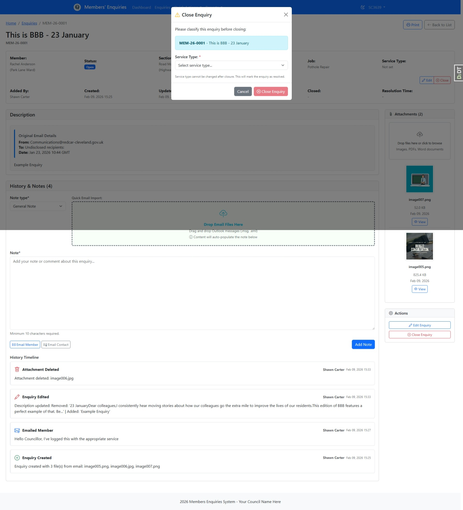
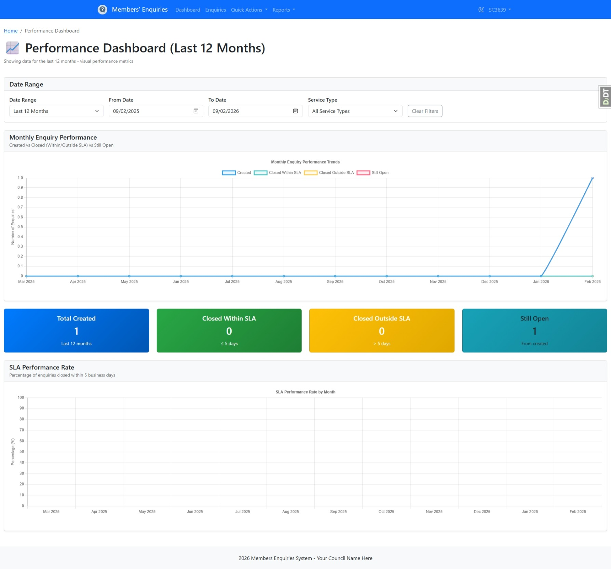
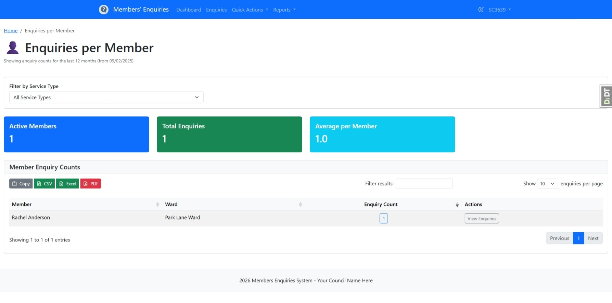
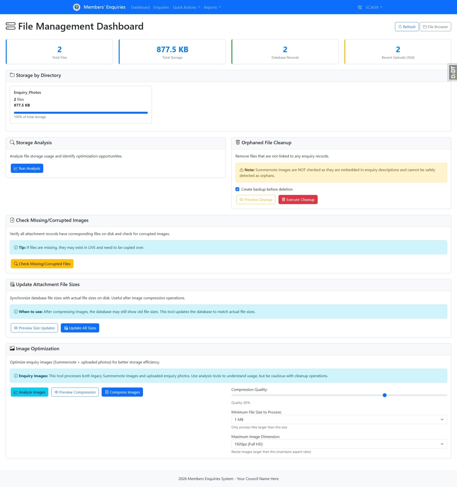

# Members Enquiries Application

A Django-based web application for managing council member enquiries with Azure AD authentication, email parsing, and some reporting tools.

## Features

### Enquiry Management
- **Create enquiries** - Manually create enquiries with member details, contacts, job types, and descriptions
- **Email integration** - Drag/Drop Emails from Outlook to automatically parse enquiry emails and create records with attachments
- **Edit enquiries** - Update enquiry details, reassign to different contacts, or change status
- **Reopen enquiries** - Reopen previously closed enquiries with updated information
- **Status tracking** - Track enquiry lifecycle: open, closed.
- **Service types** - Categorise enquiries by service type for reporting
- **Reference numbers** - Auto-generated unique references (e.g., MEM-26-0001) per enquiry

### Email & Attachment Handling
- **Automatic email parsing** - Extract enquiry information directly from email messages (supports .msg and .eml formats)
- **Attachment extraction** - Automatically extract and store images (JPG, PNG, GIF, WEBP, TIFF) and documents (PDF, DOC, DOCX) from emails
- **Image optimisation** - Automatically resize large images to optimise storage while maintaining quality
- **File management** - Store and retrieve all extracted documents and images with enquiries
- **Email conversation history** - Preserve full email conversation threads with enquiry records

### Enquiry Filtering & Search
- **Search by reference** - Find enquiries by their unique reference number
- **Filter by status** - View enquiries by status (open, pending, closed)
- **Filter by member** - Find all enquiries from a specific council member
- **Filter by ward** - View enquiries for a specific geographic ward
- **Filter by section** - Filter enquiries by responsible department section
- **Filter by job type** - Find enquiries by type of work (pothole repair, housing issue, etc.)
- **Filter by service type** - Categorise enquiries by service area
- **Filter by contact** - Find enquiries assigned to a specific contact
- **Date range filtering** - Search enquiries by creation date or custom date ranges
- **Overdue tracking** - Quickly identify enquiries exceeding response time targets
- **Search text** - Full-text search across enquiry titles and content

### Reporting & Analytics
- **Performance dashboard** - Overview of enquiry metrics and system health
- **Response time analysis** - Track average time to close enquiries by section and job type
- **Overdue enquiries** - Monitor enquiries that have exceeded expected response times
- **Enquiry distribution reports** - View enquiry counts by section, job type, member, and other attributes
- **Drilldown capability** - Click through reports to view detailed enquiry lists filtered by the selected attribute (member, job type, section, etc.)
- **Monthly trends** - Track enquiries created and resolved per month
- **Detailed reports** - Generate CSV exports for further analysis

### Administration & Data Management
- **Admin interface** - Django admin at `/admin/` for direct database management
- **Member management** - Add, edit, and manage council members with ward assignments and active/inactive status
- **Contact management** - Maintain contact details, link contacts to departments (sections), geographic areas, and job types
- **User management** - Create and manage admin users with appropriate permissions
- **Audit logging** - Track all user actions for security and compliance (who made changes, when, and what happened)
- **Data integrity** - Automatic enforcement of relationships between entities (no orphaned data)

### Security & Access Control
- **Azure AD integration** - Single sign-on with Azure Entra ID (formerly Azure AD)
- **Role-based access** - Users need to be in Admin group to create new enquiries (could allow Members Read Access)
- **Content Security Policy** - Strict CSP to prevent XSS and injection attacks
- **CSRF protection** - Built-in Django CSRF token protection
- **Secure headers** - HTTP security headers for production deployments
- **Input validation** - Validation of all user inputs

## Screenshots

### Welcome Page

*Welcome page with Sign in with Microsoft*

### Enquiry Management

*Create a new enquiry with member details, contacts, and attachments (member will be selected if their email matches)*


*Enquiries list with comprehensive filtering and search options*


*Detailed enquiry view with history, attachments, and action buttons*


*Close enquiry dialog with Service Type*

### Reporting & Analytics

*Performance dashboard with key metrics and enquiry statistics*


*Report showing enquiries per member with drilldown capability to view detailed enquiry lists*

### Administration

*File management interface for organising enquiry attachments and documents  - removing orphaned documents, resizing images etc*

## Quick Start

### Prerequisites
- Python 3.13+
- Git
- pip (included with Python)

### Installation

1. **Clone the repository**
   ```bash
   git clone https://github.com/RCBC-Dev/members-public.git
   cd members-public
   ```

2. **Create a virtual environment**
   ```bash
   python -m venv venv
   ```

3. **Activate the virtual environment**

   **Windows (PowerShell):**
   ```powershell
   .\venv\Scripts\Activate.ps1
   ```

   **Windows (Command Prompt):**
   ```cmd
   venv\Scripts\activate.bat
   ```

   **Linux/macOS:**
   ```bash
   source venv/bin/activate
   ```

4. **Install dependencies**
   ```bash
   pip install -r requirements.txt
   ```

   **What does this do?** The `requirements.txt` file contains a list of Python libraries (called "packages") that this application needs to run. These include Django (the web framework), libraries for Azure authentication, database drivers, and many others. `pip install` downloads and installs all these packages so the application can use them.

5. **Run migrations**
   ```bash
   python manage.py migrate
   ```

   **What does this do?** Migrations create and update your database structure to match the application's data models. When you run migrate, Django creates all the necessary tables (members, enquiries, contacts, etc.) and fields in the database. This happens automatically - you only need to run it once when first setting up, or when you pull code changes that modify the database structure. Since this installation uses a flattened migration, it's a single step instead of applying 20+ individual migrations.

6. **Populate test data (optional, for development)**
   ```bash
   python manage.py populate_test_data
   ```

   **What does this do?** This creates sample data in the database so you can test the application without manually entering everything. It creates example members, wards, departments, contacts, and job types that you can use to create enquiries.

7. **Create a superuser (optional, for admin access)**
   ```bash
   python manage.py createsuperuser
   ```

   **What does this do?** A superuser is an administrator account that has access to the Django admin interface at `/admin/`. This is useful for managing users and data directly. You can skip this if you don't need admin access.

8. **Start the development server**
   ```bash
   python manage.py runserver
   ```

   Access the application at `http://localhost:8000`

### Development Login Options

**Option 1: Using Azure AD (Recommended)**
Log in using your Azure AD account. You'll need to set up Azure AD first (see Azure AD Configuration below).

**Option 2: Using Django Admin (Development Only)**
If you want to test the application without Azure AD setup:

1. Create a Django superuser account:
   ```bash
   python manage.py createsuperuser
   ```
   Follow the prompts to create a username and password.

2. Log in at `http://localhost:8000/admin/` with your superuser credentials

3. Create an Admin record for your user:
   - Go to **Members App** → **Admins**
   - Click **Add Admin**
   - Select your user account
   - Save

**Important**: Whether you use Azure AD or Django admin login, you must add your account to Admin table, to have the ability to create new enquiries.Users not in Admin record can still view the application.

## Azure AD Configuration

This application uses Azure Active Directory for authentication. Follow these steps to set it up.

### Register an Application in Azure

1. Go to [Azure Portal](https://portal.azure.com)
2. Navigate to **Azure Active Directory** → **App registrations** → **New registration**
3. Enter application details:
   - **Name**: Members Enquiries Application
   - **Supported account types**: Choose based on your organisation's needs
4. Click **Register**

### Retrieve Credentials

After registration, you'll need three pieces of information:

- **App ID (Client ID)**: Found in the **Overview** section
- **Tenant ID**: Found in the **Overview** section
- **App Secret**: Create in **Certificates & secrets** → **Client secrets** → **New client secret**
  - Give it a meaningful description
  - Select an appropriate expiration (consider a yearly rotation policy)
  - Copy the secret value immediately (you won't be able to see it again)

### Configure Redirect URIs

1. Go to **Authentication** in your app registration
2. Add Redirect URIs for each environment:
   - **Development**: `http://localhost:8000/accounts/microsoft/login/callback/`
   - **Testing**: `https://your-test-domain.org/accounts/microsoft/login/callback/`
   - **Production**: `https://your-production-domain.org/accounts/microsoft/login/callback/`

**Important**: Use `localhost` (not `127.0.0.1`) for development mode. Azure AD will reject `127.0.0.1` as a security measure.

**Note**: Replace `your-test-domain.org` and `your-production-domain.org` with your actual domain names where the application will be hosted.

### Environment Configuration

1. **Copy the example file**:
   ```bash
   copy .env_example .env
   ```

2. **Edit `.env` with your credentials**:
   ```env
   ENVIRONMENT=development
   DJANGO_SECRET_KEY=your-secret-key-here

   # Azure Entra ID Configuration
   AZURE_CLIENT_ID=your-app-id-here
   AZURE_CLIENT_SECRET=your-app-secret-here
   AZURE_TENANT_ID=your-tenant-id-here

   # Database Configuration (if using SQL Server)
   DATABASE_NAME=members_db
   DATABASE_USER=sa
   DATABASE_PASSWORD=your-password
   DATABASE_HOST=localhost
   DATABASE_PORT=1433
   ```

**Security Note**: The `.env` file is already excluded from version control via `.gitignore`. Never commit the `.env` file as it contains sensitive credentials.

## Environment-Specific Configuration

The application uses different settings files for each environment:
- `project/settings/development.py` - Local development
- `project/settings/test.py` - Testing environment
- `project/settings/production.py` - Production deployment

### Testing Environment Changes

When deploying to TEST, update `project/settings/test.py`:

1. **ALLOWED_HOSTS**: Update to your test domain
   ```python
   ALLOWED_HOSTS = ['your-test-domain.org', 'localhost']
   ```

2. **CSRF_TRUSTED_ORIGINS**: Update to match your test domain
   ```python
   CSRF_TRUSTED_ORIGINS = ['https://your-test-domain.org']
   ```

3. **CORS_ALLOWED_ORIGINS**: Update to your test domain
   ```python
   CORS_ALLOWED_ORIGINS = ['https://your-test-domain.org']
   ```

4. **DATABASES**: Update with your test database credentials
   ```python
   DATABASES = {
       'default': {
           'ENGINE': 'mssql',
           'NAME': 'members_test_db',
           'USER': os.environ.get('DATABASE_USER'),
           'PASSWORD': os.environ.get('DATABASE_PASSWORD'),
           'HOST': os.environ.get('DATABASE_HOST'),
           'PORT': os.environ.get('DATABASE_PORT'),
       }
   }
   ```

5. **ACCOUNT_DEFAULT_HTTP_PROTOCOL**: Ensure set to `https`
   ```python
   ACCOUNT_DEFAULT_HTTP_PROTOCOL = 'https'
   ```

### Production Environment Changes

When deploying to PRODUCTION, update `project/settings/production.py`:

1. **ALLOWED_HOSTS**: Update to your production domain only
   ```python
   ALLOWED_HOSTS = ['your-production-domain.org']
   ```

2. **DEBUG**: Must be `False`
   ```python
   DEBUG = False
   ```
   **Important**: Debug mode exposes sensitive information. Only enable if troubleshooting a critical issue, and always disable before returning to normal operation.

3. **CSRF_TRUSTED_ORIGINS**: Update to production domain
   ```python
   CSRF_TRUSTED_ORIGINS = ['https://your-production-domain.org']
   ```

4. **CORS_ALLOWED_ORIGINS**: Update to production domain
   ```python
   CORS_ALLOWED_ORIGINS = ['https://your-production-domain.org']
   ```

5. **DATABASES**: Update with production database credentials and ensure it's a dedicated SQL Server instance
   ```python
   DATABASES = {
       'default': {
           'ENGINE': 'mssql',
           'NAME': 'members_prod_db',
           'USER': os.environ.get('DATABASE_USER'),
           'PASSWORD': os.environ.get('DATABASE_PASSWORD'),
           'HOST': os.environ.get('DATABASE_HOST'),
           'PORT': os.environ.get('DATABASE_PORT'),
       }
   }
   ```

6. **STATIC_ROOT**: Update to your production path
   ```python
   STATIC_ROOT = '/var/www/enquiries/staticfiles'
   ```

7. **MEDIA_ROOT**: Update to your production path
   ```python
   MEDIA_ROOT = '/var/www/enquiries/media'
   ```

8. **SECRET_KEY**: Use a strong, unique key generated from `django.core.management.utils.get_random_secret_key()`

9. **Security Headers**: Review and enable additional security headers

### CORS and WhiteNoise Configuration

The application uses WhiteNoise for static file serving and implements CORS headers.

**Update `application/whitenoise_headers.py`** for each environment:

1. **Development** (`development.py`): WhiteNoise is disabled
2. **Test** (`test.py`): Add any test-specific CORS requirements
3. **Production** (`production.py`): Ensure restrictive CORS headers and security headers

Example configuration in settings:
```python
WHITENOISE_ADD_HEADERS_FUNCTION = add_cors_headers
```

Update the `add_cors_headers` function to return appropriate headers for your environment.

### Content Security Policy (CSP)

The application implements a strict Content Security Policy to prevent security vulnerabilities like XSS attacks. When making changes:
- **Avoid inline CSS and JavaScript** where possible - use classes and external stylesheets instead
- If inline code is absolutely necessary, use `nonce="{{ request.csp_nonce }}"` in script/style tags:
  ```html
  <style nonce="{{ request.csp_nonce }}">
    /* inline styles here */
  </style>
  ```
- Move CSS to `static/custom.css` and apply using classes:
  ```html
  <div class="my-custom-class">Content</div>
  ```
- Use locally-hosted stylesheets and scripts, not external CDNs (unless explicitly allowed in CSP settings)

## Populating Test Data

To quickly set up a development environment with sample data:

```bash
python manage.py populate_test_data
```

This command creates:
- **Wards**: 7 sample wards (Civic Centre, Riverside, Hillside, etc.)
- **Areas**: 6 areas for organising enquiries geographically
- **Departments**: 7 departments (Planning, Highways, Housing, etc.)
- **Sections**: 8 sections within departments
- **Job Types**: 9 common job types (Pothole Repair, Planning Query, Housing Issue, etc.)
- **Contacts**: 6 contact records linked to sections
- **Members**: 12 sample council members with UK names (John Smith, Sarah Johnson, etc.)

This data allows you to immediately start creating and testing enquiries without manual data entry. You can run this command multiple times safely - it won't create duplicates.

## Running Tests

Run the test suite:
```bash
python -m pytest
```

Run specific test file:
```bash
python -m pytest tests/test_models.py -v
```

Run with coverage:
```bash
python -m pytest --cov=application --cov=project --cov-report=term-missing
```

## Development Server Management

The development server is typically run in a separate terminal:
```bash
python manage.py runserver
```

**Note**: The server must be running separately. Don't start it in the background from scripts.

## Database Migrations

Create a new migration after model changes:
```bash
python manage.py makemigrations
```

Apply migrations:
```bash
python manage.py migrate
```

For production deployments, a single consolidated migration is preferred to avoid running 20+ individual migrations.

### Database Indexes

The application includes carefully designed database indexes for optimal query performance:

**Primary Lookup Indexes:**
- `Area.name`, `Department.name`, `Section.name`, `Ward.name`, `JobType.name` - unique lookups
- `ReferenceSequence.year` - reference number generation
- `Contact.name` - contact lookups
- `Member.email` - member searches
- `Enquiry.reference` - unique enquiry references

**Common Query Indexes:**
- `Member`: (ward, is_active), (email), (first_name, last_name)
- `Enquiry`: Multiple indexes for status, created_at, member, section, admin, contact, job_type, and title lookups
- `EnquiryHistory`: (enquiry, created_at) for timeline queries
- `EnquiryAttachment`: (enquiry, uploaded_at) for attachment retrieval
- `Audit`: (user, action_datetime) and (enquiry, action_datetime) for audit trails
- `Contact`: (section) for section-based filtering

These indexes ensure that the most common queries run efficiently, particularly filtering enquiries by status, member, section, and retrieval of related records. The indexes were validated and added during setup.

## Git Hooks and Automatic Version Management

This project includes Git hooks that automatically validate code quality and update version numbers on commits.

### Setting Up Git Hooks

```bash
python setup_git_hooks.py
```

This script sets up two Git hooks:

1. **pre-commit hook** - Automatically runs all tests before allowing a commit. If any tests fail, the commit is rejected until you fix the issues.
2. **commit-msg hook** - Automatically updates the version number in `project/version.py` based on your commit message

### Using commit.bat (Recommended)

The easiest way to commit changes is using the `commit.bat` script:

```bash
commit "Your descriptive commit message here"
```

**What it does:**
- Stages all changes with `git add .`
- Runs tests via the pre-commit hook
- If tests pass, creates the commit with your message
- Automatically updates the version number in `project/version.py`
- Amends the commit to include the version update (without running tests again)

**Benefits over `git commit -m`:**
- ✅ Ensures tests pass before committing
- ✅ Automatically increments version numbers (patch, minor, or major based on commit message)
- ✅ Version history is tracked automatically - no manual version bumping needed
- ✅ Cleaner workflow - one command does everything
- ✅ Prevents broken code from being committed
- ✅ Cross-platform (Windows, Mac, Linux)

### Manual Commit Process

If you prefer manual control, you can still use `git commit`:

```bash
git add .
git commit -m "Your commit message"
```

The hooks will still run automatically. If you want to skip version updates, include `[skip version]` in your message:

```bash
git commit -m "Your message [skip version]"
```

## Static Files

Collect static files for production:
```bash
python manage.py collectstatic --noinput
```

## Troubleshooting

### "Apps aren't loaded yet" Error
Ensure the `DJANGO_SETTINGS_MODULE` environment variable is set or pytest-django is properly configured in `pytest.ini`.

### Azure Authentication Failures
- Verify redirect URIs in Azure AD match exactly (including protocol and trailing slash)
- Use `localhost` not `127.0.0.1` in development
- Check that App Secret hasn't expired
- Ensure environment variables are correctly set in `.env`

### Database Connection Issues
- Verify database credentials in `.env`
- Ensure SQL Server is running and accessible
- For SQLite (development): check file permissions
- Run `python manage.py dbshell` to test connection

## Security Considerations

1. **Secret Key**: Change `DJANGO_SECRET_KEY` in `.env` for each deployment
2. **Debug Mode**: Set `DEBUG=False` in production
3. **HTTPS**: Always use HTTPS in production
4. **CORS**: Keep CORS origins as restrictive as possible
5. **CSP**: Review and maintain Content Security Policy headers
6. **Dependencies**: Regularly update packages with `pip install --upgrade -r requirements.txt`
7. **Azure Secrets**: Rotate Azure App Secrets annually
8. **Environment Variables**: Never commit `.env` to version control

## Deployment

### Hosting Options

This application can be deployed to various hosting environments:

**Current Setup: IIS (Windows Server)**
- Uses IIS with **HTTPPlatformHandler**
- Runs **Waitress** WSGI server as the application server
- Supports large file uploads (up to 100MB for email processing)
- Includes security headers (HSTS, CSP, etc.)

**Alternative Hosting**
- **Azure App Service** - Native Azure hosting with integrated monitoring
- **Cloud Providers** - AWS, Google Cloud, DigitalOcean, or other cloud platforms
- **Docker** - Containerize the application for any Docker-compatible platform
- **Linux Servers** - Deploy using gunicorn or other Python WSGI servers

### IIS Configuration (Windows Server)

1. **Create web.config from template**:
   ```bash
   copy webconfig.template web.config
   ```

2. **Update paths in web.config**:
   - Replace `C:\path\to\members-public` with your actual installation path
   - Update `processPath` to point to your virtual environment's `python.exe`
   - Update `arguments` to point to your `serve.py` file
   - Update `stdoutLogFile` path for logs
   - Set correct `DJANGO_SETTINGS_MODULE` (test, production, etc.)

3. **Key configuration parameters**:
   - `maxAllowedContentLength="104857600"` - 100MB limit for email attachments
   - `startupTimeLimit="120"` - 2 minute startup timeout
   - Security headers for HTTPS and protection against common attacks

4. **Install prerequisites**:
   - IIS with URL Rewrite and Application Request Routing (ARR) modules
   - Python 3.13 (or compatible version)
   - All packages from `requirements.txt`

### Database Configuration

The application supports multiple database backends:

**Development** (Default)
- SQLite - No configuration needed, file-based database

**Production** - Choose one:

**Azure SQL Database**
```python
# In project/settings/production.py
DATABASES = {
    'default': {
        'ENGINE': 'mssql',
        'NAME': 'your-database-name',
        'USER': 'your-username@server-name',
        'PASSWORD': os.environ.get('DATABASE_PASSWORD'),
        'HOST': 'server-name.database.windows.net',
        'PORT': 1433,
        'OPTIONS': {
            'driver': 'ODBC Driver 17 for SQL Server',
            'extra_params': 'TrustServerCertificate=yes',
        }
    }
}
```

**PostgreSQL**
```python
# In project/settings/production.py
DATABASES = {
    'default': {
        'ENGINE': 'django.db.backends.postgresql',
        'NAME': 'enquiries_db',
        'USER': 'postgres_user',
        'PASSWORD': os.environ.get('DATABASE_PASSWORD'),
        'HOST': 'database.example.com',
        'PORT': 5432,
    }
}
```
Install PostgreSQL driver: `pip install psycopg2-binary`

**Other Databases** (MySQL, Oracle, etc.)
- Update the `ENGINE` setting to the appropriate database backend
- Install the required Python driver package
- Update `HOST`, `PORT`, and credentials

### Environment Variables for Deployment

Ensure these are set on your production server:

```env
ENVIRONMENT=production
DJANGO_SECRET_KEY=your-secret-key-here
DEBUG=False
ALLOWED_HOSTS=your-domain.org

# Database (adjust based on your database choice)
DATABASE_NAME=enquiries_db
DATABASE_USER=db_user
DATABASE_PASSWORD=secure-password
DATABASE_HOST=db-server.example.com
DATABASE_PORT=1433

# Azure AD (if using)
AZURE_CLIENT_ID=your-app-id
AZURE_CLIENT_SECRET=your-secret
AZURE_TENANT_ID=your-tenant-id
```

### Deployment Checklist

- [ ] Copy `webconfig.template` to `web.config` (IIS only)
- [ ] Update all paths in web.config for IIS deployment
- [ ] Update database credentials in `.env`
- [ ] Set `DEBUG=False` in settings
- [ ] Generate new `DJANGO_SECRET_KEY`
- [ ] Update `ALLOWED_HOSTS` in settings
- [ ] Update `CSRF_TRUSTED_ORIGINS` in settings
- [ ] Configure CORS origins appropriately
- [ ] Update `ACCOUNT_DEFAULT_HTTP_PROTOCOL=https` in settings
- [ ] Run `python manage.py collectstatic --noinput`
- [ ] Run `python manage.py migrate` on production database
- [ ] Test Azure AD login (if configured)
- [ ] Verify logs folder has write permissions
- [ ] Set up log rotation for production logging

## License

This software is licensed under the GNU Affero General Public License v3.0.
Copyright © 2026 Redcar & Cleveland Borough Council.

For the full license terms, see [LICENSE.md](LICENSE.md).

This program is free software: you can redistribute it and/or modify it under the terms of the GNU Affero General Public License as published by the Free Software Foundation, version 3.

This program is distributed in the hope that it will be useful, but without any warranty; without even the implied warranty of merchantability or fitness for a particular purpose. See the GNU Affero General Public License for more details.

You should have received a copy of the GNU Affero General Public License along with this program. If not, see <https://www.gnu.org/licenses/>.

Should you need to contact the copyright holder, you can email [shawn.carter@redcar-cleveland.gov.uk](mailto:shawn.carter@redcar-cleveland.gov.uk).

## Contributing

We welcome contributions from councils, developers, and the open source community! Whether it's bug fixes, security improvements, documentation, or new features, your help is appreciated.

**Before you start:** Please read [CONTRIBUTING.md](CONTRIBUTING.md) for guidelines on how to contribute, what we accept, and how to submit pull requests.

**Discuss first:** For new features or major changes, please open an issue to discuss before coding.

**Contact:** shawn.carter@redcar-cleveland.gov.uk

## Security

If you discover a security vulnerability, please **do not open a public issue**. Instead, email:
**shawn.carter@redcar-cleveland.gov.uk**

For full details, see [SECURITY.md](SECURITY.md).

## Support

For deployment support or questions about configuration, contact your internal IT department or the development team.

**Repository**: https://github.com/RCBC-Dev/members-public
